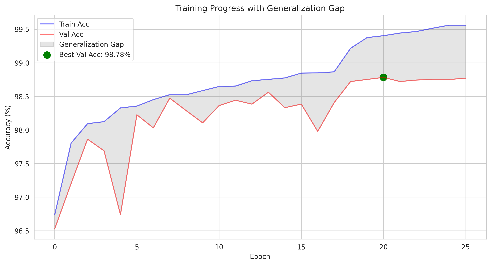
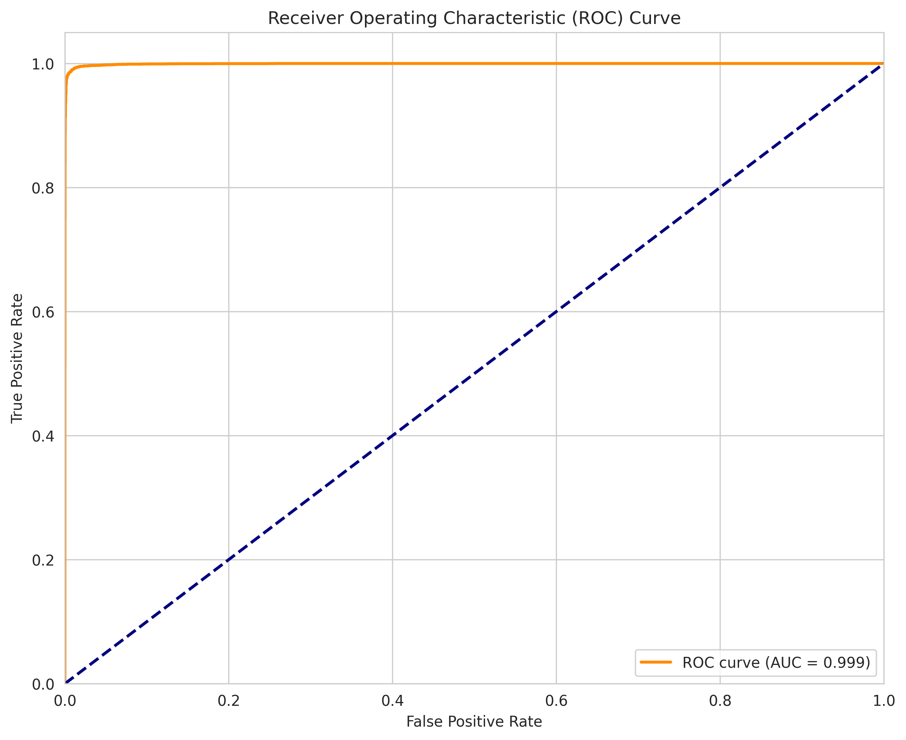
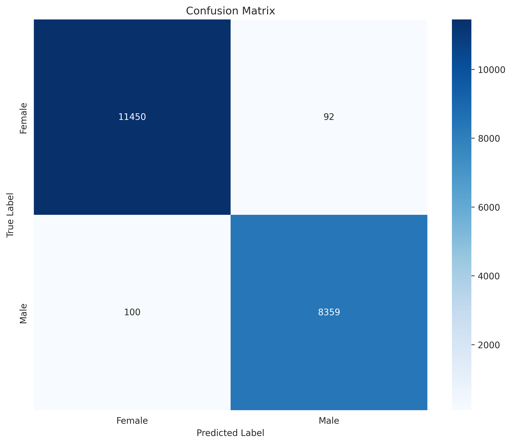

# Real-Time Gender Detection System

A high-performance deep learning system for real-time gender detection using PyTorch and OpenCV. The system achieves 99.04% accuracy on a large-scale dataset and supports real-time detection through webcam, image files, and video sources.

## Project Overview

This project implements a gender detection system using a ResNet50 model trained on a diverse dataset. The system can:
- Perform real-time gender detection through webcam
- Process individual images
- Analyze video files
- Generate detailed performance metrics and visualizations

## Dataset

The model is trained on a comprehensive gender detection dataset containing over 200k+ face images:


- **Image Characteristics**:
  - High-quality facial images
  - Diverse age groups
  - Various ethnicities
  - Different lighting conditions
  - Multiple facial expressions
  - Various head poses

- **Dataset Organization**:
  ```
  Dataset/
  ├── Train/
  │   ├── Female/
  │   └── Male/
  ├── Validation/
  │   ├── Female/
  │   └── Male/
  └── Test/
      ├── Female/
      └── Male/
  ```

- **Dataset Access**: 
  <div align="center">
  
  [](https://www.kaggle.com/datasets/yasserhessein/gender-dataset)
  
  </div>

## Model Performance

The model achieves exceptional performance metrics:

### Test Set Evaluation Results
- Overall Accuracy: 99.04%
- ROC AUC Score: 0.9994
- Dataset Size: 20,001 test images
- Processing Speed: ~1.22ms per image on NVIDIA L4 GPU

### Class-wise Performance
```
              precision    recall  f1-score   support
Female        0.99      0.99      0.99     11,542
Male          0.99      0.99      0.99      8,459
```

### Performance Visualizations

#### Training Progress

*Shows the model's training and validation accuracy over epochs, highlighting the consistently high performance and minimal generalization gap.*

#### Learning Curves

*Displays the loss curves, accuracy progress, learning rate evolution, and generalization gap analysis.*

#### Model Evaluation

*ROC curve showing the model's excellent discrimination ability with an AUC of 0.9994.*


*Confusion matrix demonstrating balanced performance across both gender classes.*

## Features

1. **Multiple Detection Modes**:
   - Real-time webcam detection
   - Single image processing
   - Video file analysis
   

2. **High Performance**:
   - GPU-accelerated inference
   - Optimized batch processing
   - Real-time FPS counter
   - Processing statistics

3. **Visualization**:
   - Bounding box detection
   - Gender prediction labels
   - Confidence scores
   - Real-time FPS display

## Technical Implementation

### Model Architecture
- Base Model: ResNet50
- Final Layer: Custom FC layer for binary classification
- Input Size: 224x224 RGB images
- Output: Binary classification (Male/Female) with confidence scores

### Key Components
1. Face Detection:
   - OpenCV's Haar Cascade Classifier
   - Optimized for real-time performance

2. Gender Classification:
   - PyTorch-based deep learning model
   - Mixed precision inference
   - CUDA optimization for GPU acceleration

3. Image Processing:
   - Real-time frame processing
   - Dynamic resizing and normalization
   - Efficient memory management

## Usage

1. **Installation**:
   ```bash
   pip install -r requirements.txt
   ```

2. **Running the System**:
   ```bash
   python gender_detection.py
   ```

3. **Menu Options**:
   ```
   Gender Detection Menu:
   1. Real-time Webcam Detection
   2. Image File Detection
   3. Video File Detection
   4. Exit
   ```

## Requirements

- Python 3.8+
- PyTorch
- OpenCV
- CUDA-capable GPU (optional but recommended)
- Other dependencies in requirements.txt

## Performance Optimization

The system is optimized for both CPU and GPU execution:
- Batch processing for efficient GPU utilization
- Non-blocking memory transfers
- Mixed precision inference
- CUDA stream synchronization
- Efficient memory management
- OpenCV optimization

## Results and Metrics

The model demonstrates excellent performance across various metrics:

1. **Speed**:
   - Real-time processing at high FPS
   - Minimal latency
   - Efficient batch processing

2. **Accuracy**:
   - 99.04% overall accuracy
   - Balanced performance across genders
   - High confidence predictions

3. **Reliability**:
   - Robust face detection
   - Stable frame processing
   - Consistent performance


## License

This project is licensed under the MIT License - see the LICENSE file for details.